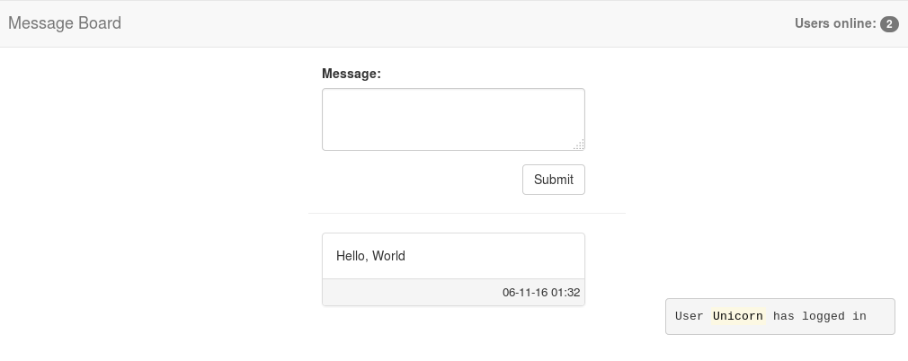

# Description

A simple message board backed by Spring

# Features

- Posting
- Online users counter
- Notifications

# Screenshot



# Building and running

1. Bash ``` $ gradle war ```
2. Deploy war to servlet container or AS(e.g. Tomcat)
3. Bash ``` $ cd frontend ``` and ``` $ bower install ```
3. Open page ```frontent/index.html``` in any browser 
